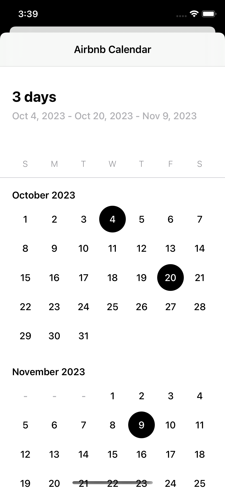
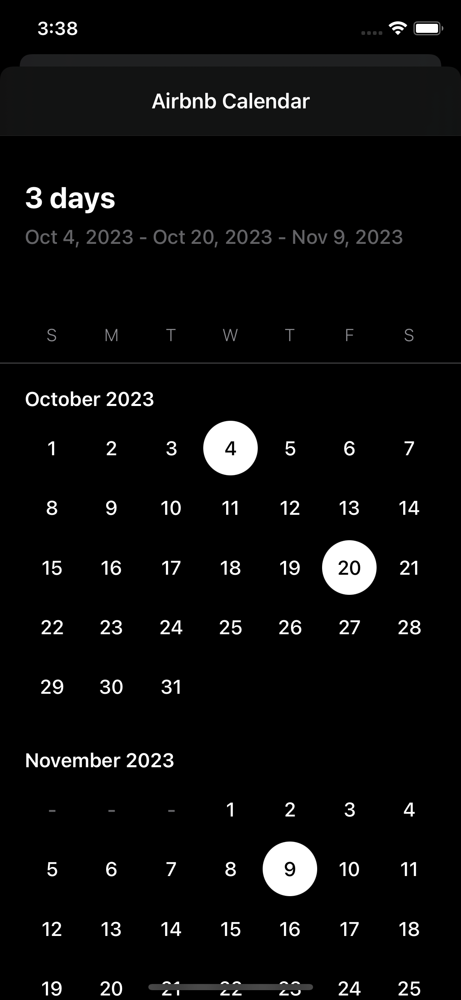

## Aribnb-like calendar
This calendar playground aims to replicate **Airbnb's** calendar currently implemented on the app.

### Libraries / Frameworks
- Reactive: **Combine**
- CollectionViews: **NSDiffableDataSource & NSCompositionalLayout**

| Light |  Dark |
| --- | --- |
|  |  |

### TODO
- [ ] Add range-selection feature.
- [ ] Add clear all selected days.
- [ ] Refactor some code.
- [x] Create multi-selection feature.
- [ ] Add options to change from single/multi/range selection.

###### A 🌟 would be highly appreciated!!
